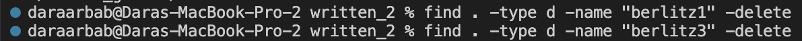

Dara Arbab

Lab Report 3

# The "Find" Command

The find command is a very useful command that has plenty of versatile options.

The first option I learned through a website called softwareengineeringhelp.com. I got there by googling "find command options".

This is a simple option, it's to add the letter "i" in front of -name. like so:

-iname

What this does is tells the find command to not be case sensitive to the name you give it.

This also works the same way for directories, not just files.

The next command option I learned about was also from the same website. It's a useful option called maxdepth.
As find searches recursively, you might not want find to search the deepest child directories in your path.
Using -maxdepth 1 will limit the amount of child directories find can search by 1, respectively.

A third find command option I learned about was from a website called stackoverflow.com.
There was a forum post discussing find and it's options.

This was the -ls or list option. This allows you to tell find to find everything, not just one thing.
you can also tell it to find everything of a specific type.

Here is find -ls working on only files.

And here is find -ls working on only directories.

The fourth and last command I learned about was from the same forum post on stackoverflow.com.
It is also the command I find most interesting.
It's -delete! You can use find to delete files!
You can also use it to delete directories, although, the directory must be empty for it to delete it.

